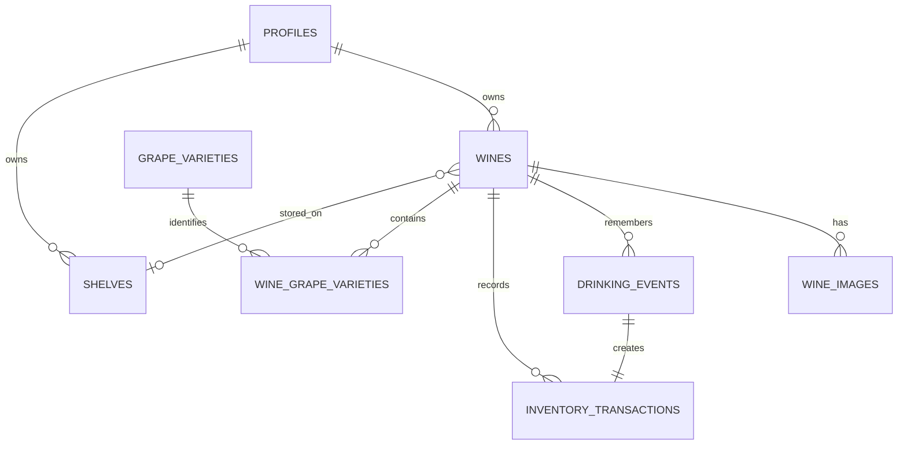

# Database schema

The database is deliberately small and personal. Every data row is owned by the authenticated user, and PostgreSQL row-level security prevents one account from reading another account's records.

## Main records

- `wines`: one row per producer, wine/cuvée, vintage and bottle size. A row is retained when its quantity reaches zero.
- `shelves`: Shelf 1 through Shelf 6, ordered from the top of the EuroCave.
- `inventory_transactions`: the permanent quantity ledger.
- `drinking_events`: one diary entry per consumed bottle, with an optional 1–10 rating and tasting note.
- `grape_varieties` and `wine_grape_varieties`: reusable grape names that allow future preference analysis.
- `wine_images`: metadata for one front and one optional back image. The private Storage objects are configured separately.

## Inventory integrity

`wines.current_quantity` is a fast cached balance. Application users cannot edit it directly. Database operations add the matching ledger entry and update the cached balance atomically.

The supported operations are:

- `create_wine_with_initial_inventory`
- `add_bottles`
- `drink_one`
- `adjust_inventory`

The database rejects any operation that would reduce a quantity below zero. Drinking a bottle creates both its diary entry and its `-1` inventory transaction in the same database transaction.

## Version 1 simplifications

- One fridge, with no separate storage-area table.
- One shelf per wine record, with no split shelf balances.
- Bottle size is 750 ml by default or 375 ml for a half bottle.
- Prices are optional GBP prices per bottle and are stored as integer pennies.
- Blank vintage means non-vintage and is displayed as `NV` by the application.
- Archiving is independent of quantity; reaching zero never deletes or archives a wine automatically.
